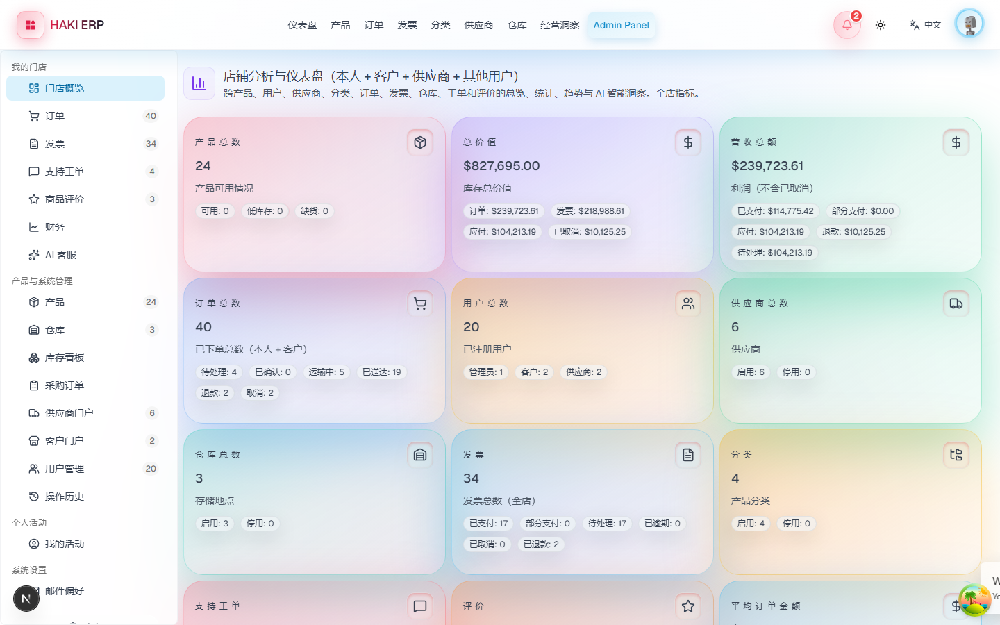

# HAKI ERP —— 出口贸易企业数字化管理系统

> 面向出口贸易企业的全流程管理系统：订单、库存、采购、财务、业绩、审批一体覆盖，
> 支持企业内部五个岗位角色与外部供应商 / 客户协同。

## 项目背景

外贸企业的日常运转横跨多个岗位：业务员跟进客户与订单、仓库管理出入库、
采购对接供应商、财务核对收付款与业绩归属，各环节依赖表单和聊天工具串联，
数据分散、口径不一。本系统把这条链路收敛到一套平台里：

- 订单从录入到发货全程留痕，审批与库存联动自动执行
- 库存分仓管理，锁定 / 可用数量实时准确
- 业绩按业务员和归属月份统计，支持财务人工调整
- 供应商与客户拥有独立门户，协作信息与内部数据隔离

本项目同时作为毕业设计作品，完整代码、数据库设计与部署方案一并开源。

## 技术栈

| 层次 | 选型 |
| --- | --- |
| 框架 | Next.js 16（App Router）+ React 19 + TypeScript 5 |
| 界面 | Tailwind CSS 3.4 + shadcn/ui（Radix） |
| 数据库 | PostgreSQL 17 + Prisma ORM 6 |
| 认证 | JWT Cookie 会话 + bcrypt 加密 |
| 状态管理 | TanStack Query 5（服务端状态）+ Zustand（UI 状态） |
| 表单校验 | React Hook Form + Zod |
| 测试 | Vitest 4 |
| 部署 | Docker Compose + Nginx + GitHub Actions |

## 在线演示

**https://124.220.15.30**

演示站运行在腾讯云轻量服务器上（Docker 编排部署）。未购买域名，使用自签证书，
浏览器首次访问会提示"连接不安全"——点「高级」→「继续前往」即可，属正常现象。

## 界面预览




更多页面截图见 [docs/screenshots](./docs/screenshots)。

## 功能模块

### 订单管理
- 订单创建、编辑、明细管理，支持多商品与出口贸易字段（币种、汇率、贸易条款、报关单号、装卸港）
- 状态流转：草稿 → 待审批 → 已通过 / 已拒绝 → 已发货 → 已送达（未发货可取消）
- 审批留痕：审批人、动作、意见与时间完整记录，仅管理员可批
- 库存联动：草稿不占用，审批通过按行锁定，发货扣减，取消与拒绝精确释放

### 库存管理
- 库存看板：当前 / 锁定 / 可用数量与补货阈值，低库存自动预警
- 分仓库存（主仓 / 保税仓 / 中转仓）、库存调拨
- 商品 SKU 管理、分类与供应商关联、CSV / Excel 批量导入导出

### 采购与供应商
- 供应商主数据维护
- 采购单创建与收货入库：一个事务内同时增加商品总量与分仓数量，已收货不可重复
- 采购明细 CSV 导出（带 BOM，Excel 打开不乱码）

### 财务与业绩
- 发票管理：草稿 → 已发送 → 已支付 / 逾期，支持部分收款
- 月度经营分析：销售额、采购成本、利润，含客户与商品排名
- 业绩统计：按业务员 × 归属月份核算，支持跨月人工调整并留痕

### AI 客服
- 内置知识库（订单 / 审批 / 库存 / 采购 / 财务 / 物流等，中英各半）负责检索
- 大模型负责组织语言；未配置密钥或调用失败时降级为知识库直答

### 自动化与协同
- 订单状态变更站内通知、低库存自动预警（同商品告警去重）
- 客户主数据（国家、联系人、目的港）
- 供应商门户 / 客户门户（外部协作，数据与内部隔离）
- 工单系统、商品评价（审核制）
- 操作日志：关键动作（创建 / 审批 / 发货 / 收款）全量留痕

### 多语言
- 默认中文界面，可切换英文，语言偏好跟随账号、跨设备生效
- 以英文原文作为词条键，缺失时自动回退英文，改造过程始终可用

## 快速开始

### 环境要求

- Node.js 24.x
- PostgreSQL 17（本地或容器）

### 安装与初始化

```bash
# 1. 安装依赖
npm install

# 2. 配置环境变量
cp .env.example .env
# 编辑 .env，至少设置 DATABASE_URL、JWT_SECRET、NEXT_PUBLIC_API_URL

# 3. 建库并执行迁移
npx prisma migrate deploy

# 4. 写入演示数据（20 人企业，9 个月业务历史）
npm run db:seed

# 5. 启动开发服务器
npm run dev
```

访问 http://localhost:3000。

### 容器化启动

```bash
docker compose up -d --build
docker compose --profile seed run --rm seed   # 首次灌入演示数据
```

访问 https://localhost（自签证书，浏览器需手动放行）。

### 演示账号

统一密码：`12345678`

| 角色 | 账号 | 说明 |
| --- | --- | --- |
| 管理员 | admin@haki.com | 全量工作台、审批订单、用户管理、经营看板 |
| 业务员 | sales@haki.com | 订单创建跟进、业绩查看 |
| 财务 | finance@haki.com | 发票、收付款、业绩核算 |
| 仓库 | warehouse@haki.com | 库存、拣货、发货 |
| 采购 | purchase@haki.com | 供应商品与补货 |
| 供应商 | supplier@haki.com | 供应商门户（外部） |
| 客户 | client@haki.com | 客户门户（外部） |

登录页支持按角色一键填充账号。

## 项目结构

```
├── app/                  页面与 API 路由（App Router）
│   ├── api/              REST 接口
│   ├── admin/            管理员工作台
│   └── orders/ products/ invoices/ ...   业务页面
├── components/           界面组件（按业务域划分）
├── prisma/
│   ├── schema.prisma     数据模型（26 张业务表）
│   ├── seed.ts           演示数据种子脚本
│   └── migrations/       数据库迁移记录
├── lib/                  服务端数据装配、校验模式、业务规则
├── deploy/               容器部署脚本与 Nginx 配置
├── utils/                JWT 会话签发与校验
└── types/                全局类型定义
```

更多架构细节见 [架构说明.md](./架构说明.md)。

## 数据库设计

26 张业务表，核心关系：

- `Order` 关联 `Customer`（客户）、`OrderItem`（明细）、`Invoice`（发票）
- `Performance` 记录业绩归属（订单 × 业务员 × 年月）
- `Approval` 记录每一笔审批动作
- `StockAllocation` 管理分仓库存
- 外键约束由 PostgreSQL 强制，避免悬空引用

## 部署

本地与容器化部署步骤、环境变量说明、持续集成配置见[部署文档](./部署文档.md)。

## 文档索引

| 文档 | 内容 |
| --- | --- |
| [架构说明.md](./架构说明.md) | 目录结构、分层设计、数据模型 |
| [操作手册.md](./操作手册.md) | 各角色操作路径与常见问题 |
| [部署文档.md](./部署文档.md) | 本地与容器化部署、环境变量、CI |
| [项目总结报告.md](./项目总结报告.md) | 开发过程、核心设计、质量保障与实践总结 |
| [问题排查报告-业绩月份.md](./问题排查报告-业绩月份.md) | 数据归属异常排查的完整证据链 |
| [SECURITY.md](./SECURITY.md) | 安全问题反馈方式 |

## 许可证

基于 [Stockly](https://github.com/arnobt78/Warehouse-Stock-Inventory-Management-System--NextJS-FullStack)（MIT License）改造，
针对出口贸易场景进行了数据库迁移、业务字段扩展与角色体系重构。许可证详见 [LICENSE](./LICENSE)。