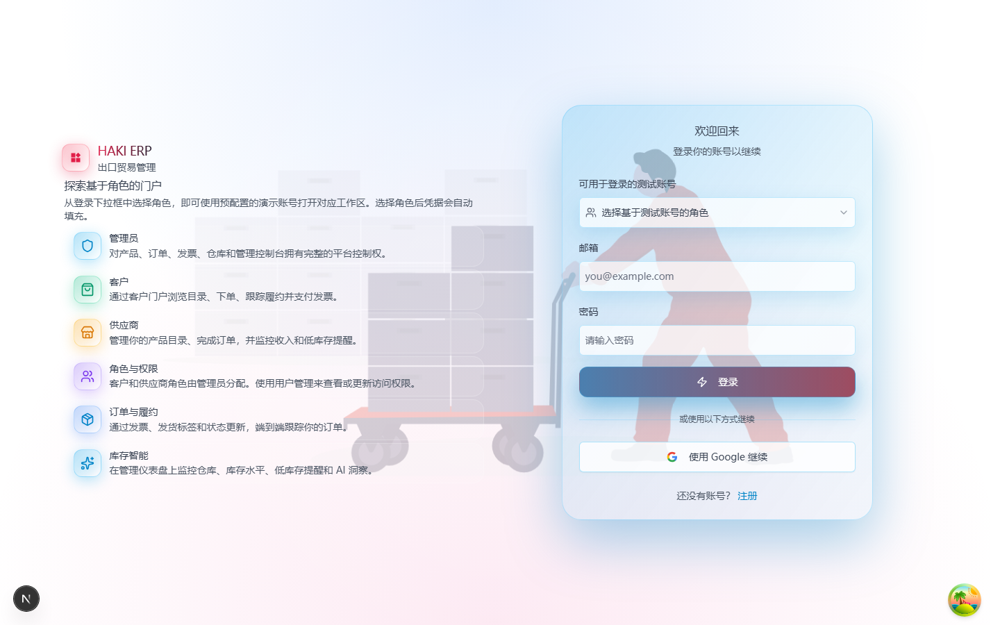
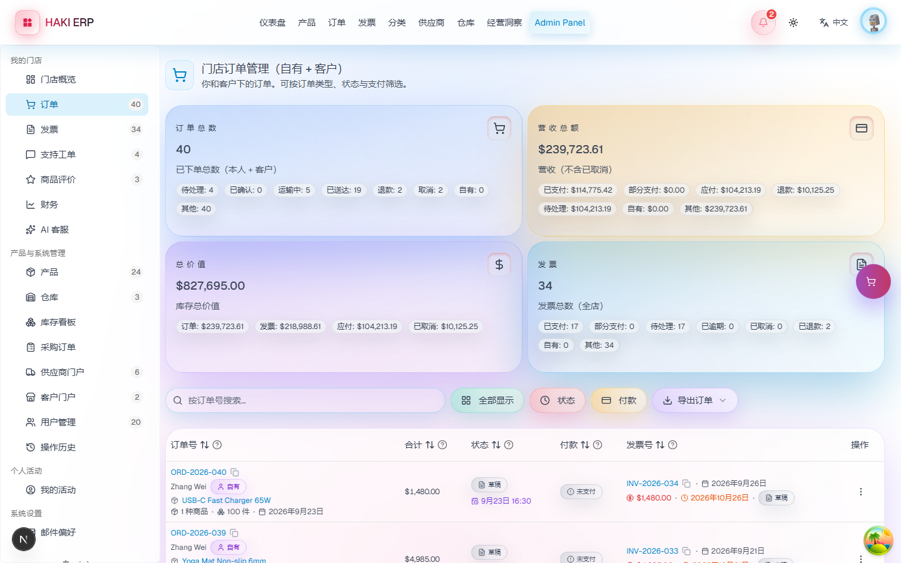
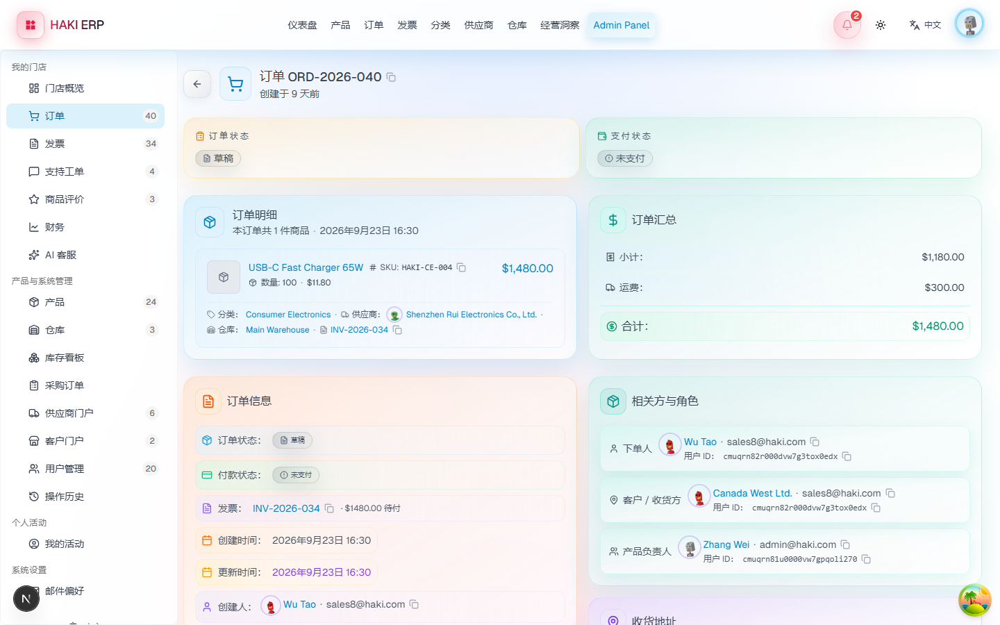
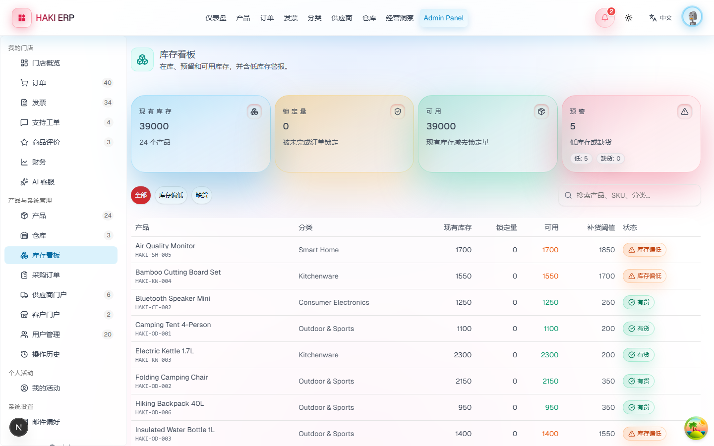
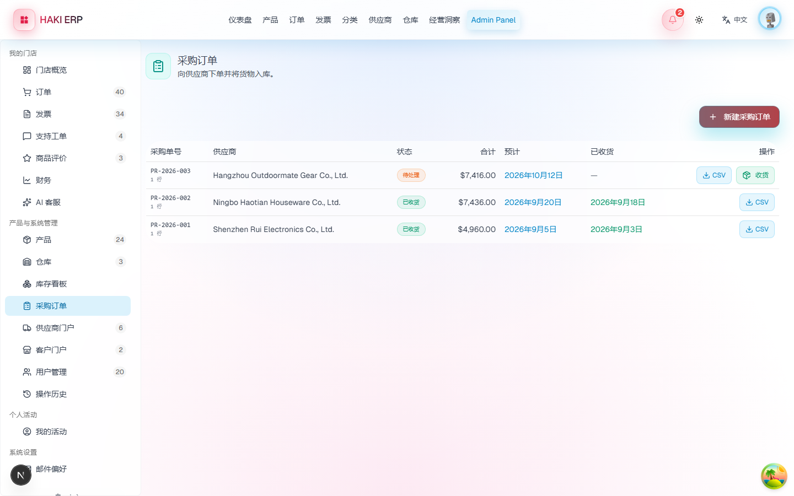
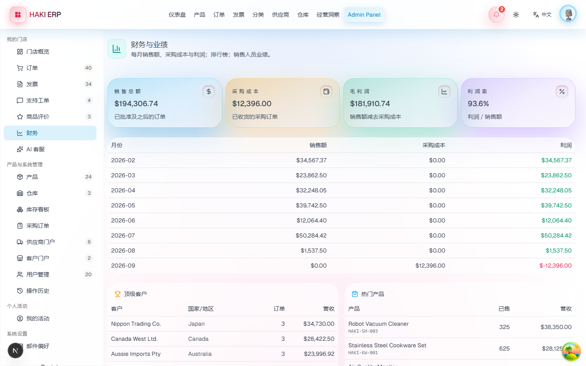
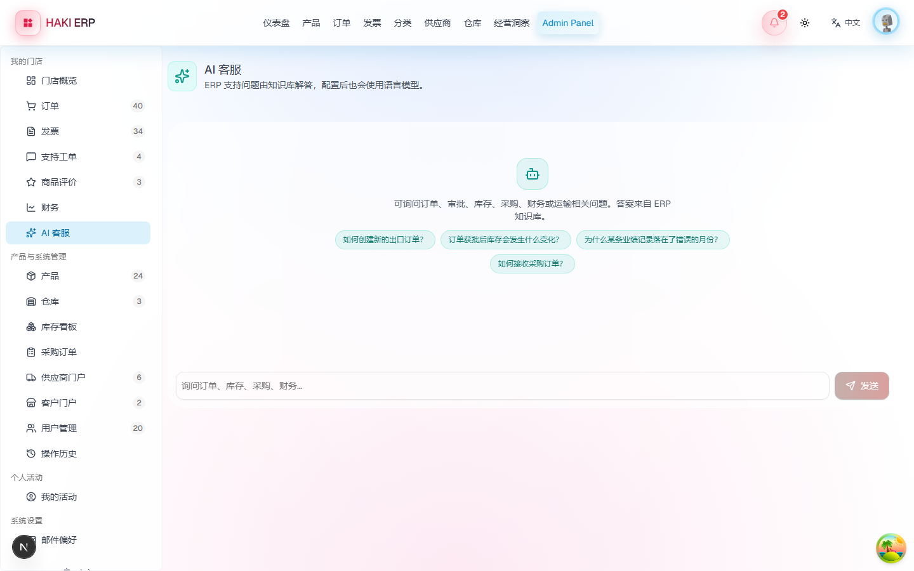
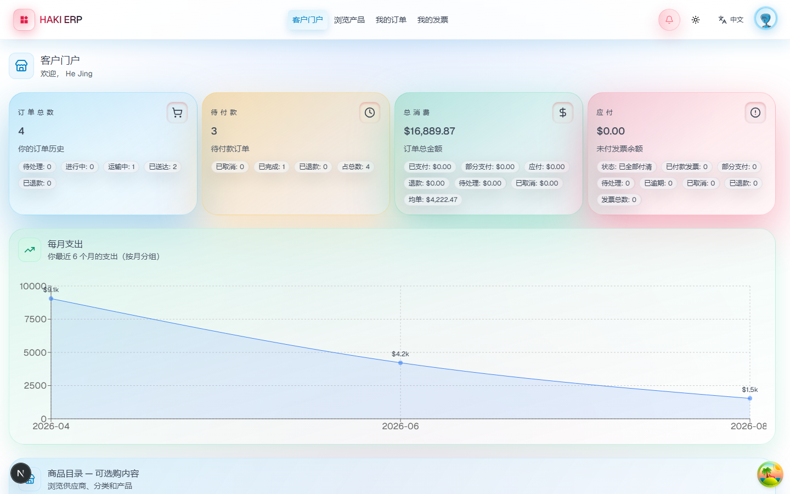

# HAKI ERP 操作手册

> 面向系统使用者，说明各角色的日常操作路径。截图见 [docs/screenshots](./docs/screenshots)。

## 一、系统概述

HAKI ERP 是面向出口贸易企业的一体化管理平台，把订单、库存、采购、财务、业绩、
审批与外部协同收敛到一处。系统按岗位划分权限，企业内部五个岗位各管一段流程，
外部供应商与客户通过独立门户参与协作。

## 二、登录与角色

访问系统后进入登录页，页面上提供"按角色选择测试账号"的入口，点选角色即可自动填入账号，
无需手记。



演示账号统一密码为 `12345678`。

| 角色 | 账号 | 主要职责 |
| --- | --- | --- |
| 管理员 | admin@haki.com | 审批订单、查看经营看板、管理用户与系统配置 |
| 业务员 | sales@haki.com | 创建与跟进订单、查看个人业绩 |
| 财务 | finance@haki.com | 发票与收付款、业绩归属核算 |
| 仓库 | warehouse@haki.com | 库存查看、采购收货、发货 |
| 采购 | purchase@haki.com | 供应商与采购单维护 |
| 供应商 | supplier@haki.com | 供应商门户（外部） |
| 客户 | client@haki.com | 客户门户与自助下单（外部） |

登录后左侧为导航菜单，菜单项按角色自动裁剪，看不到与自己无关的模块。

## 三、订单管理

### 3.1 订单全流程

订单状态按出口贸易的审批场景设计：

```
草稿 draft → 待审批 pending → 已通过 approved / 已拒绝 rejected
                              → 已发货 shipped → 已送达 delivered
（任意未发货阶段可取消 cancelled）
```

- **草稿**：业务员录入中的订单，不占用库存，可自由修改。
- **待审批**：提交后进入审批队列，等待管理员处理。
- **已通过**：管理员核准后，系统按订单明细锁定库存。
- **已发货 / 已送达**：仓库执行后扣减库存。
- **已拒绝 / 已取消**：释放此前锁定的库存。

### 3.2 创建订单

进入订单页点击"创建订单"，依次选择客户、填写商品明细，并补齐出口贸易字段：
结算币种、汇率、贸易条款（FOB / CIF / EXW 等）、报关单号、装运港、目的港。
保存为草稿或直接提交审批。



### 3.3 审批订单

管理员在订单详情页点击审批按钮，可填写意见后通过或拒绝。
审批前系统会逐行校验可用库存，数量不足时整单拒绝，不会产生部分锁定。
每次审批都会写入审批记录并通知相关人员。



审批历史以卡片形式展示审批人、动作、意见与时间，订单详情页可直接查看。

## 四、库存管理

### 4.1 库存看板

库存看板展示每个商品的当前库存、锁定量、可用量与补货阈值，低于阈值时高亮为低库存。



三个数量的关系是：

```
可用量 = 当前库存 − 锁定量
```

锁定量合并了两条来源：审批时按产品锁定的数量，以及已分配到具体仓库的拣货量。
二者相加与订单审批的实际效果一致。

### 4.2 分仓与调拨

商品可分布在主仓、保税仓、中转仓等多个仓库。仓库之间可做库存调拨，
调拨只改变分布，不改变总量。

## 五、采购管理

采购单围绕"下单—收货—入库"展开：

1. 创建采购单：选择供应商、收货仓库，录入商品明细与单价。
2. 等待到货后执行收货：系统在同一事务内同时增加商品总量与指定仓库的分仓数量。
3. 已收货的采购单不可重复收货，避免重复入库。

采购明细支持导出 CSV，导出文件带 BOM 头，用 Excel 打开中文不乱码。



## 六、财务与业绩

财务页面分两块内容。

**财务报表**：按月统计销售额（已通过之后的订单）、采购成本（已收货的采购单）
与利润，并给出客户排名与商品销量排名。

**业绩统计**：按业务员 × 归属月份汇总业绩，明细可调整归属年月并填写调整理由，
调整会记录操作人与日志。



业绩归属按**出货月份**计算，而非下单月份——货未发出不计业绩。
订单月、出货月、归属月三者可以不同，调整入口就是为这类跨月归属准备的。

## 七、AI 客服

AI 客服页是一个内置的知识库问答入口：提问后系统先在知识库中检索相关文章，
命中后作为上下文交给大模型组织语言；未配置模型密钥或调用失败时，
直接返回知识库原文，功能不中断。

知识库预置订单、审批、库存、采购、财务、物流、币种等常见问题，中英各半。



## 八、外部门户

供应商与客户使用各自账号登录后进入独立门户，
看到的范围受账号关联关系限制，不会触及内部经营数据。

- 供应商门户：查看自己名下的商品与相关订单。
- 客户门户：查看自己的订单，也可自助下单。



## 九、语言切换

系统默认中文界面，可随时切换为英文。切换入口在门店顶栏与管理侧边栏底部。

语言偏好跟随账号保存，换设备登录同样生效；未登录访客的语言选择保存在本地。

## 十、常见问题

**登录后菜单很少？**
菜单按角色裁剪，这是正常的权限行为。需要更多功能请使用对应角色账号。

**订单提交后库存没变？**
提交审批不锁库存，审批通过才锁定。这是为了避免草稿单占用可用库存。

**业绩月份和下单单月份对不上？**
业绩按出货月份归属。此类差异可在财务页的业绩明细中调整归属年月并填写理由。

**AI 客服回答像是知识库原文？**
当模型密钥未配置或调用失败时，系统降级为直接返回知识库答案，属预期行为。

**页面数据显示空白？**
先确认是否已灌入演示数据，操作见[部署文档](./部署文档.md)。